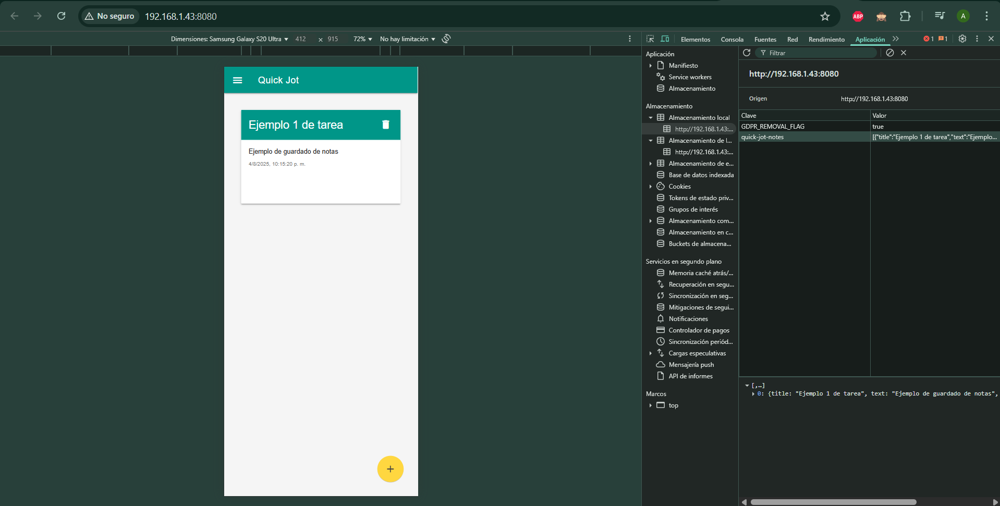
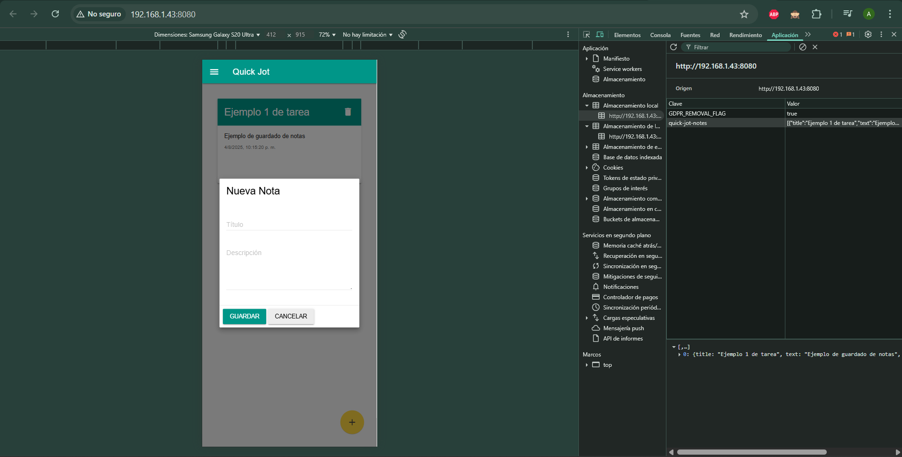
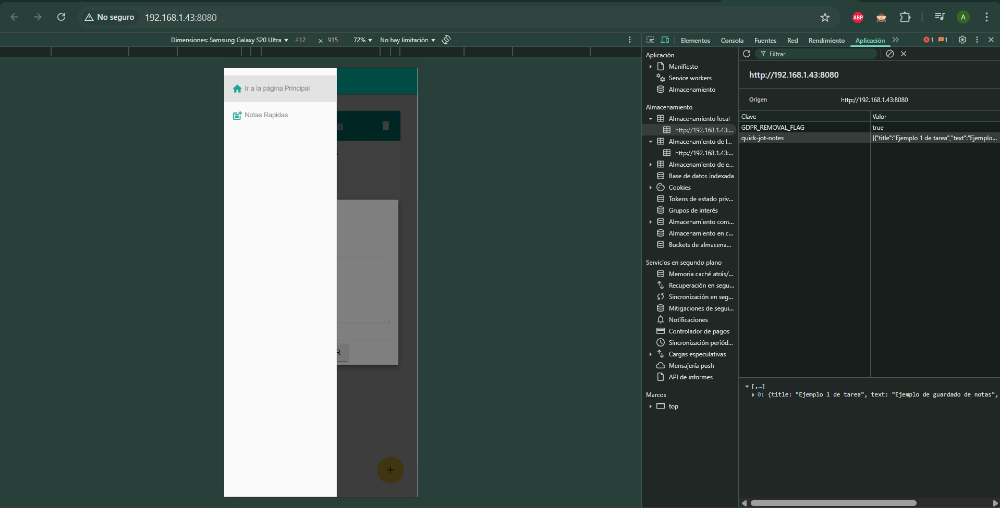

# Quick Jot - Aplicación de Notas PWA

Quick Jot es una aplicación web progresiva (PWA) para tomar notas rápidas que funciona incluso sin conexión a internet. Desarrollada con Material Design Lite, ofrece una experiencia limpia y responsiva.

## Características principales

- 📝 Crear notas con título y descripción
- 🗑️ Eliminar notas con confirmación
- 💾 Persistencia de datos en localStorage
- 📱 Diseño responsivo para móviles y desktop
- ⚡ Funcionamiento offline (PWA)
- 🎨 Interfaz basada en Material Design

## Tecnologías utilizadas

- HTML5
- CSS3
- JavaScript (ES6)
- [Material Design Lite](https://getmdl.io/)
- Service Workers
- Web App Manifest

## Requisitos del sistema

- Navegador web moderno (Chrome, Firefox, Edge, Safari)
- Node.js (para desarrollo)

## Instalación y ejecución

1. Clona el repositorio:
```bash
git clone https://github.com/Alexmig24/PWA_Material-Design.git
```

2. Instala las dependecias
```bash
npm install
```

3. Inicia el servidor de desarrollo:
```bash
npm run serve
```

4. Abre tu navegador en:
```bash
http://localhost:8080
```
---
## Cómo usar la aplicación
1. Haz clic en el botón flotante (+) para agregar una nueva nota
2. Completa el título (opcional) y la descripción
3. Haz clic en "Guardar"
4. Para eliminar una nota, haz clic en el ícono de basura en la esquina superior derecha de cada nota

## Funcionamiento offline

La aplicación está diseñada para funcionar sin conexión gracias a:

- Service Worker que cachea los recursos esenciales
- Almacenamiento local de las notas en el navegador
- Estrategia "Cache First" para los recursos estáticos

## Capturas de pantalla


